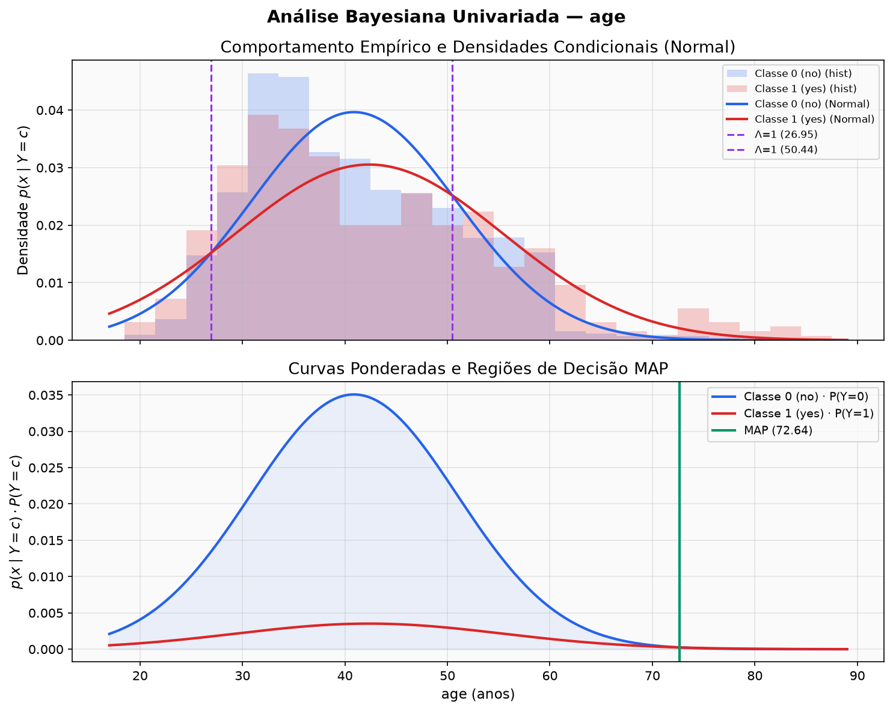
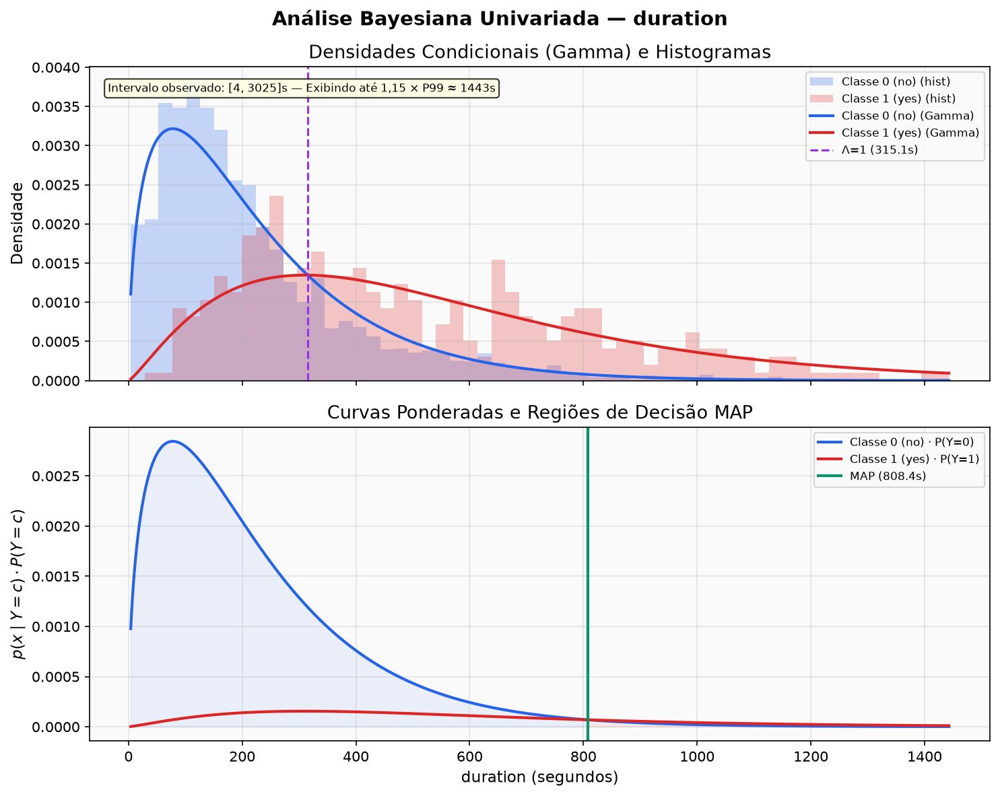
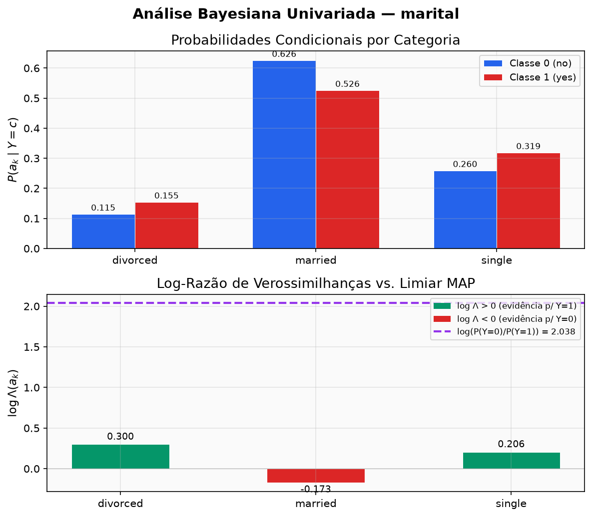
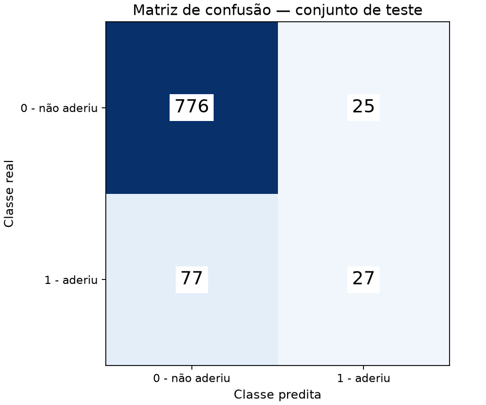

# Projeto de IA: Classificação Bayesiana Pura e Mista

Implementação rigorosa e reproduzível de um classificador probabilístico supervisionado baseado em **Inferência Bayesiana Pura** sobre o dataset bancário [UCI Bank Marketing](https://archive.ics.uci.edu/dataset/222/bank+marketing). A regra do classificador foi implementada pela dupla, sem uso de um classificador pronto; o SciPy é empregado apenas no ajuste numérico do MLE da distribuição Gamma e em diagnósticos auxiliares.

## Execução rápida — passo a passo

O roteiro abaixo parte de uma máquina com Python 3.12 ou superior. Se o repositório já
estiver baixado, entre na pasta `Projeto-2VA` e comece pela criação do ambiente virtual.

### Windows — PowerShell

```powershell
# 1. Baixar o projeto e entrar na raiz
git clone https://github.com/IA-PV/Projeto-2VA.git
cd Projeto-2VA

# 2. Criar e ativar o ambiente virtual
python -m venv .venv
.\.venv\Scripts\Activate.ps1

# 3. Instalar as dependências fixadas
python -m pip install -r requirements.txt

# 4. Validar o dataset, o split e o ajuste do modelo
python -m src.run_experiment --validate-only

# 5. Executar todos os testes automatizados
python -m pytest -q

# 6. Reproduzir todas as análises, figuras e a avaliação final
python -m src.run_experiment --force-reproduce

# 7. Consultar as métricas finais
Get-Content .\reports\metrics\final_metrics.json
```

### Linux ou macOS — Bash

```bash
# 1. Baixar o projeto e entrar na raiz
git clone https://github.com/IA-PV/Projeto-2VA.git
cd Projeto-2VA

# 2. Criar e ativar o ambiente virtual
python3 -m venv .venv
source .venv/bin/activate

# 3. Instalar as dependências fixadas
python -m pip install -r requirements.txt

# 4. Validar o dataset, o split e o ajuste do modelo
python -m src.run_experiment --validate-only

# 5. Executar todos os testes automatizados
python -m pytest -q

# 6. Reproduzir todas as análises, figuras e a avaliação final
python -m src.run_experiment --force-reproduce

# 7. Consultar as métricas finais
cat reports/metrics/final_metrics.json
```

As tabelas são gravadas em `reports/metrics/` e as figuras em `reports/figures/`.
O comando com `--force-reproduce` acessa o holdout e registra uma nova execução auditada;
para regenerar apenas as análises preservando a avaliação existente, use
`python -m src.run_experiment`.

---

## 1. Título e Objetivo

- **Título**: Estudo Dirigido de Inferência e Classificação Bayesiana Supervisionada.
- **Objetivo**: Estimar probabilidades a priori e verossimilhanças condicionais a partir de dados reais, comparar formulações teóricas (Normal, Gamma e Categórica com Laplace), analisar o comportamento probabilístico univariado (razão de verossimilhanças $\Lambda(x)$, fronteiras de decisão e posteriors normalizadas) e combinar as evidências em um classificador ingênuo misto (*Mixed Naive Bayes*), auditando seu desempenho contra o holdout congelado e confrontando-o com o baseline majoritário.

---

## 2. Integrantes

- **Vitor Antônio Silvestre Santos**
- **Pedro Tobias Souza Guerra**

---

## 3. Origem e Versão do Dataset

- **Dataset**: Amostra reduzida oficial contendo **4.521 observações** e 17 atributos do conjunto [Bank Marketing da UCI](https://archive.ics.uci.edu/dataset/222/bank+marketing) (`bank.csv`).
- **Arquivo local**: [`data/raw/bank.csv`](data/raw/bank.csv).
- **Integridade Criptográfica (SHA-256 com LF normalizado)**:
  `dc8d576e9bda0f41ee891251bd84bab9a39ce576cba715aac08adc2374a01fde`
- **Substituição**: A fonte de dados é congelada. Qualquer alteração ou substituição exige atualização e revisão formal do contrato de dados.

### 3.1 Atributos disponíveis e tipos

A amostra possui 16 atributos preditores e a variável-alvo `y`. A classificação abaixo considera tanto o tipo armazenado no CSV quanto o significado de cada variável:

| Atributo | Tipo | Significado resumido |
|---|---|---|
| `age` | Numérico inteiro | Idade do cliente |
| `job` | Categórico nominal | Ocupação |
| `marital` | Categórico nominal | Estado civil |
| `education` | Categórico ordinal | Escolaridade declarada |
| `default` | Categórico binário | Inadimplência de crédito |
| `balance` | Numérico inteiro | Saldo médio anual |
| `housing` | Categórico binário | Empréstimo habitacional |
| `loan` | Categórico binário | Empréstimo pessoal |
| `contact` | Categórico nominal | Meio de contato |
| `day` | Numérico inteiro | Dia do mês do último contato |
| `month` | Categórico nominal | Mês do último contato |
| `duration` | Numérico inteiro positivo | Duração do último contato, em segundos |
| `campaign` | Numérico inteiro | Contatos realizados nesta campanha |
| `pdays` | Numérico inteiro | Dias desde o contato anterior; `-1` indica ausência de contato anterior |
| `previous` | Numérico inteiro | Contatos anteriores à campanha atual |
| `poutcome` | Categórico nominal | Resultado da campanha anterior |
| `y` | Categórico binário (alvo) | Adesão ao depósito a prazo: `no` ou `yes` |

---

## 4. Problema de Classificação

O problema consiste em prever se um cliente bancário subscreverá um depósito a prazo fixo (*term deposit*) após uma abordagem telefônica de marketing direto.
O desafio central reside no **desbalanceamento severo das classes**:
- Na base total de 4.521 amostras, **88,48%** (4.000) pertencem à classe negativa (`no`) e apenas **11,52%** (521) à classe positiva (`yes`).
- Na presença de fortes desbalanceamentos, a acurácia isolada é enganosa (um classificador ingênuo que preveja sempre `no` atinge ~88,5% de acurácia com recall zero). A modelagem bayesiana lida explicitamente com as probabilidades a priori e as razões de verossimilhança.

---

## 5. Alvo e Classes

A variável-alvo $y$ é mapeada de maneira estrita e determinística:
- `no` $\rightarrow \mathbf{0}$ (classe negativa: o cliente não subscreveu o produto).
- `yes` $\rightarrow \mathbf{1}$ (classe positiva: o cliente subscreveu o produto).
- A ordem canônica dos rótulos em todas as matrizes e métricas é $\mathbf{[0, 1]}$.

---

## 6. Três Atributos Selecionados

Conforme definido no contrato de dados e na especificação do projeto, foram selecionados exatamente três atributos de tipos distintos:
1. **`age`** (numérico inteiro, modelado como contínuo): Idade do cliente (faixa observada nesta amostra: 19 a 87 anos).
2. **`duration`** (numérico inteiro positivo, modelado como contínuo): Duração do último contato telefônico em segundos (faixa observada nesta amostra: 4 a 3.025 segundos).
3. **`marital`** (categórico politômico): Estado civil do cliente com domínio estrito $\mathcal{D} = \{\text{divorced}, \text{married}, \text{single}\}$.

As características foram escolhidas para combinar dois tipos de evidência em um único classificador e permitir análises com interpretações distintas. `age` representa um perfil demográfico disponível antes da campanha; `duration` representa o nível de engajamento observado durante a ligação e possui forte associação empírica com a resposta; `marital` introduz uma variável nominal de três categorias. Essa escolha também permite demonstrar explicitamente a combinação de densidades contínuas com probabilidades discretas.

---

## 7. Resumo das Distribuições e Modelagem

Toda a estimação de parâmetros é realizada **estritamente sobre as 3.616 observações de treinamento** (livre de vazamento de dados / data leakage):

| Componente | Família Probabilística | Método de Estimação no Treino |
|---|---|---|
| **Prior** $P(Y=c)$ | Empírica | Frequência relativa: $N_c / N_{\text{train}}$ ($P(0) \approx 0{,}8847$, $P(1) \approx 0{,}1153$) |
| **`age`** | Normal (Gaussiana) | $\hat{\mu}_c$ e $\hat{\sigma}_c^2$ via MLE com $N_c$ no denominador (`ddof=0`) |
| **`duration`** | Gamma | Forma $\hat{k}_c$ e escala $\hat{\theta}_c$ via MLE com localização fixa em zero (`floc=0`) |
| **`marital`** | Categórica | Frequência com suavização de Laplace: $\frac{N_{c,k} + \alpha}{N_c + \alpha K}$ com $\alpha=1$ e $K=3$ |
| *Diagnóstico* | Exponencial | Taxa $\hat{\lambda}_c = 1/\bar{x}_c$; superada pela Gamma no critério AIC |

### 7.1 Justificativas das hipóteses probabilísticas

- **`age` — Normal:** idades de clientes adultos tendem a se concentrar em torno de uma região central, com frequências menores nos extremos. A Normal fornece uma aproximação contínua simples para esse formato e permite obter uma fronteira analítica. Trata-se de uma aproximação: idade é inteira, limitada e pode misturar subpopulações, razão pela qual a aderência também é verificada visualmente nos histogramas.
- **`duration` — Gamma:** uma duração é estritamente positiva, assimétrica à direita e pode apresentar cauda longa devido a uma pequena quantidade de chamadas muito demoradas. A Gamma possui exatamente esse suporte e flexibilidade de forma. Além da justificativa de domínio, ela apresentou AIC e estatística KS menores que a Exponencial nas duas classes do treino.
- **`marital` — Categórica:** os três estados civis são resultados nominais, mutuamente exclusivos e sem distância numérica natural. Portanto, a modelagem adequada consiste em estimar $P(X=a_k\mid Y=c)$ para cada categoria. A suavização de Laplace mantém a regra definida caso alguma categoria válida não apareça em uma classe do treino.

### 7.2 Divisão dos dados e priors

A divisão estratificada preservou aproximadamente o desbalanceamento da base:

| Conjunto | Total | Classe 0 (`no`) | Classe 1 (`yes`) |
|---|---:|---:|---:|
| Base completa | 4.521 | 4.000 (88,48%) | 521 (11,52%) |
| Treino | 3.616 (80%) | 3.199 (88,47%) | 417 (11,53%) |
| Teste | 905 (20%) | 801 (88,51%) | 104 (11,49%) |

Foram usados `test_size=0.20`, `random_state=42` e estratificação por `y`. As priors estimadas exclusivamente no treino são $P(Y=0)=0{,}884679$ e $P(Y=1)=0{,}115321$.

### 7.3 Parâmetros estimados exclusivamente no treino

| Característica | Classe 0 (`no`) | Classe 1 (`yes`) |
|---|---|---|
| `age` — Normal | $\mu_0=40{,}8718$, $\sigma_0^2=101{,}2452$ | $\mu_1=42{,}3645$, $\sigma_1^2=170{,}6969$ |
| `duration` — Gamma | $k_0=1{,}5285$, $\theta_0=147{,}4478$ | $k_1=2{,}2528$, $\theta_1=247{,}8195$ |
| `marital=divorced` | 0,114616 | 0,154762 |
| `marital=married` | 0,625859 | 0,526190 |
| `marital=single` | 0,259525 | 0,319048 |

Os valores completos e as fronteiras calculadas estão em [`distribution_parameters.json`](reports/metrics/distribution_parameters.json).

- **Razão de Verossimilhança Univariada**: $\Lambda(x) = \frac{p(x \mid Y=1)}{p(x \mid Y=0)}$.
- **Regra de Decisão MAP**: Decide classe 1 se $\Lambda(x) > \frac{P(Y=0)}{P(Y=1)} \approx 7{,}6715$.
- **Combinação Multivariada**: O modelo misto assume independência condicional ingênua e soma as evidências em escala logarítmica natural:
  $$\ln P(Y=c \mid \mathbf{x}) \propto \ln P(Y=c) + \ln p(\text{age} \mid c) + \ln p(\text{duration} \mid c) + \ln P(\text{marital} \mid c)$$
  As probabilidades posteriores normalizadas são obtidas numericamente via `logsumexp`.

### 7.4 Exemplos numéricos completos do Teorema de Bayes

Para duas classes, a posterior da classe positiva é calculada por:

$$
P(Y=1\mid x)=\frac{p(x\mid Y=1)P(Y=1)}{p(x\mid Y=0)P(Y=0)+p(x\mid Y=1)P(Y=1)}.
$$

Os valores abaixo foram arredondados apenas para apresentação; o pipeline usa precisão completa.

**Exemplo 1 — `age=20`:**

$$
P(Y=1\mid 20)=
\frac{0{,}00705535\times0{,}1153208}
{0{,}00461202\times0{,}8846792+0{,}00705535\times0{,}1153208}
=\frac{0{,}00081363}{0{,}00489379}
\approx0{,}16626.
$$

Embora $p(20\mid Y=1)>p(20\mid Y=0)$ e $\Lambda(20)=1{,}5298$ forneça evidência em favor de `yes`, a posterior positiva permanece em apenas 16,63% por causa da prior majoritariamente negativa. Esse exemplo evidencia a diferença entre **verossimilhança**, que avalia o valor observado supondo uma classe, e **posterior**, que avalia a classe após combinar likelihood e prior.

**Exemplo 2 — `duration=1000`:**

$$
P(Y=1\mid 1000)=
\frac{0{,}0003609829\times0{,}1153208}
{0{,}0000238338\times0{,}8846792+0{,}0003609829\times0{,}1153208}
=\frac{0{,}0000416288}{0{,}0000627141}
\approx0{,}66379.
$$

A razão $\Lambda(1000)=15{,}1458$ supera o limiar MAP de 7,6715; por isso o classificador univariado decide `yes`.

**Exemplo 3 — `marital=divorced`:**

$$
P(Y=1\mid divorced)=
\frac{0{,}15476190\times0{,}1153208}
{0{,}11461587\times0{,}8846792+0{,}15476190\times0{,}1153208}
=\frac{0{,}01784727}{0{,}11924554}
\approx0{,}14967.
$$

Apesar de `divorced` ter $\Lambda=1{,}3503>1$, essa evidência não é suficiente para vencer a prior negativa, e a decisão continua sendo `no`. Outros valores podem ser consultados em [`age_univariate_examples.csv`](reports/metrics/age_univariate_examples.csv), [`duration_univariate_examples.csv`](reports/metrics/duration_univariate_examples.csv) e [`marital_univariate_examples.csv`](reports/metrics/marital_univariate_examples.csv).

### 7.5 Comportamento por classe e regras univariadas



- Para `age`, as distribuições apresentam forte sobreposição. A likelihood favorece `yes` abaixo de aproximadamente 26,95 anos e acima de 50,44 anos, mas, no domínio observado, a decisão MAP somente muda para `yes` acima de 72,64 anos.



- Para `duration`, chamadas curtas são mais compatíveis com `no`. A likelihood passa a favorecer `yes` em aproximadamente 315,10 segundos, enquanto a prior desloca a fronteira MAP para 808,43 segundos.



- Para `marital`, `divorced` e `single` fornecem evidência fraca em favor de `yes`, enquanto `married` favorece `no`. Nenhuma razão supera o limiar MAP; portanto, as três categorias são classificadas como `no` quando usadas isoladamente.

Qualitativamente, `duration` possui o maior poder discriminativo, seguida por `age`; `marital` é a menos discriminativa. Essa conclusão considera a separação visual, a amplitude da razão de verossimilhanças e a existência de regiões MAP positivas, sem consultar o conjunto de teste.

---

## 8. Estrutura do Repositório

```text
.
├── data/
│   └── raw/
│       └── bank.csv             # Amostra reduzida congelada (UCI)
├── notebooks/
│   └── 02_analises_univariadas.ipynb # Inspeção e visualização univariada
├── reports/
│   ├── figures/                 # Gráficos e curvas gerados programaticamente
│   │   ├── age_conditional_and_decision.png
│   │   ├── duration_conditional_and_decision.png
│   │   ├── marital_conditional_probabilities.png
│   │   └── confusion_matrix.png
│   └── metrics/                 # Relatórios JSON/CSV auditáveis versionados
│       ├── data_split.json
│       ├── distribution_parameters.json
│       ├── model_parameters.json
│       ├── final_metrics.json
│       ├── run_manifest.json
│       ├── confusion_matrix.csv
│       ├── error_groups.csv
│       ├── age_by_marital_within_class.csv
│       ├── age_univariate_examples.csv
│       ├── duration_univariate_examples.csv
│       └── marital_univariate_examples.csv
├── src/                         # Implementação da biblioteca científica
│   ├── __init__.py
│   ├── config.py                # Configuração centralizada e ExperimentConfig imutável
│   ├── data.py                  # Ingestão, validação de contrato e split estratificado
│   ├── distributions.py         # Ajuste de distribuições contínuas e categóricas
│   ├── univariate.py            # Cálculo de posteriors, odds ratio e fronteiras
│   ├── mixed_naive_bayes.py     # Classificador Bayesiano Misto próprio
│   ├── evaluation.py            # Métricas manuais, matriz de confusão e baseline
│   ├── plotting.py              # Visualizações padronizadas
│   ├── run_univariate.py        # Runner da análise univariada
│   ├── run_evaluation.py        # Runner auditado da avaliação no holdout
│   └── run_experiment.py        # Orquestrador oficial do estudo completo
├── tests/                       # Suíte automatizada de testes e validação matemática
│   ├── conftest.py
│   ├── test_data.py
│   ├── test_data_leakage.py
│   ├── test_distributions.py
│   ├── test_univariate.py
│   ├── test_mixed_naive_bayes.py
│   ├── test_evaluation.py
│   ├── test_final_evaluation.py
│   └── test_reproducibility.py  # Testes de reprodutibilidade e conformidade
├── pytest.ini                   # Configuração de execução do pytest
├── requirements.txt             # Dependências diretas com versões exatas testadas
└── README.md                    # Documentação oficial de entrega
```

---

## 9. Pré-requisitos de Ambiente

- **Linguagem**: Python $\ge$ 3.12 (pipeline e dependências fixadas validados no **Python 3.12.10**).
- **Sistema Operacional**: Windows, Linux ou macOS.
- **Gerenciador de Ambientes**: Módulo padrão `venv` do Python.

---

## 10. Instalação

Abra o terminal na raiz do repositório:

### No Windows (PowerShell):
```powershell
python -m venv .venv
.\.venv\Scripts\Activate.ps1
python -m pip install -r requirements.txt
```

### No Linux / macOS (Bash):
```bash
python3 -m venv .venv
source .venv/bin/activate
python -m pip install -r requirements.txt
```

---

## 11. Referência dos Comandos de Validação, Teste e Execução

### 11.1 Validação de Dados e Ambiente (Somente Leitura)
Executa todas as checagens formais de contrato, esquema, hash e split sem criar ou modificar nenhum arquivo em disco:
```bash
python -m src.run_experiment --validate-only
```

### 11.2 Regeneração das análises sem novo acesso ao holdout
Regenera parâmetros, tabelas CSV, figuras PNG e o manifesto. Se já existir uma avaliação
final auditada, suas métricas são preservadas para evitar acesso desnecessário ao teste:
```bash
python -m src.run_experiment
```

### 11.3 Reprodução integral, incluindo a avaliação final
Em um clone destinado à reprodução, este comando também recalcula a matriz de confusão
e as métricas do holdout. A nova execução fica registrada em `evaluation_history.json`:
```bash
python -m src.run_experiment --force-reproduce
```

### 11.4 Execução da Suíte de Testes Automatizada
Executa os 247 testes unitários, matemáticos e de integração:
```bash
pytest -q
```

### 11.5 Inspeção Interativa dos Notebooks
Para inspecionar as tabelas formatadas e diagnósticos interativamente:
```bash
python -m pip install ipykernel
```
Abra [`notebooks/02_analises_univariadas.ipynb`](notebooks/02_analises_univariadas.ipynb) no Jupyter Lab ou VS Code, selecione o kernel `.venv` e execute todas as células em ordem (`Run All`).

---

## 12. Descrição das Saídas e Métricas Auditadas

A execução do estudo consolida artefatos em `reports/`:

### 12.1 Manifesto de Execução ([`run_manifest.json`](reports/metrics/run_manifest.json))
Registra metadados de execução, plataforma, hash dos dados, hiperparâmetros e famílias de distribuição de acordo com a especificação de reprodutibilidade do projeto.

O diagnóstico [`age_by_marital_within_class.csv`](reports/metrics/age_by_marital_within_class.csv)
resume, exclusivamente no treino, a contagem e a idade média/mediana por classe e estado
civil. Ele documenta quantitativamente uma limitação da independência condicional.

### 12.2 Métricas Finais Auditadas no Holdout ([`final_metrics.json`](reports/metrics/final_metrics.json))
Resultados obtidos sobre as 905 observações congeladas de teste:

| Métrica | Classificador Misto Bayesiano | Baseline Majoritário (sempre classe 0) |
|---|---|---|
| **Acurácia** | **$88{,}73\%$** ($0{,}8873$) | $88{,}51\%$ ($0{,}8851$) |
| **Precisão** | **$51{,}92\%$** ($0{,}5192$) | $0{,}00\%$ ($0{,}0000$) |
| **Recall (Sensibilidade)** | **$25{,}96\%$** ($0{,}2596$) | $0{,}00\%$ ($0{,}0000$) |
| **F1-Score** | **$34{,}62\%$** ($0{,}3462$) | $0{,}00\%$ ($0{,}0000$) |

### 12.3 Matriz de Confusão Oficial ([`confusion_matrix.csv`](reports/metrics/confusion_matrix.csv))
Ordem canônica $[0, 1]$ (linhas: real, colunas: predito):
- **Verdadeiros Negativos (VN)**: $776$ (cliente não aderiu e o modelo previu não adesão)
- **Falsos Positivos (FP)**: $25$ (cliente não aderiu, mas o modelo previu adesão)
- **Falsos Negativos (FN)**: $77$ (cliente aderiu, mas o modelo previu não adesão)
- **Verdadeiros Positivos (VP)**: $27$ (cliente aderiu e o modelo previu adesão)
- **Total**: $776 + 25 + 77 + 27 = 905$ observações.



### 12.4 Interpretação dos erros

Os **77 falsos negativos** são o erro mais importante: representam clientes que aderiram, mas foram classificados como `no`. Todos possuem `duration` abaixo da fronteira MAP univariada de 808,43 segundos, e a mediana de duração desse grupo é 328 segundos. Para esses clientes, chamadas curtas ou moderadas, combinadas com a prior negativa de 88,47%, não produziram evidência suficiente para a decisão positiva. Como consequência, o modelo identificou somente 27 dos 104 clientes positivos, resultando em recall de 25,96%.

Os **25 falsos positivos** são clientes que não aderiram apesar da previsão `yes`. A mediana de duração desse grupo é 957 segundos, e 21 casos (84%) estão acima do percentil 95 de duração observado no treino. Isso mostra que chamadas excepcionalmente longas constituem uma evidência forte de adesão, mas não garantem o resultado: a distribuição de `duration` da classe negativa também possui uma cauda longa.

Os verdadeiros positivos possuem mediana de duração semelhante, 994 segundos. Portanto, `duration` é útil para localizar parte dos positivos, mas não separa perfeitamente os dois resultados. `age` e `marital` acrescentam evidência insuficiente para recuperar a maioria dos positivos de duração moderada.

A acurácia de 88,73% supera o baseline majoritário de 88,51% em somente 0,22 ponto percentual. Esse pequeno ganho, junto do F1 de 34,62%, confirma que a acurácia isolada é pouco informativa nesta base desbalanceada. Os resumos numéricos completos dos quatro grupos estão em [`error_groups.csv`](reports/metrics/error_groups.csv).

---

## 13. Decisões de Reprodutibilidade

- **Semente e Divisão**: Semente fixa `random_state = 42`, divisão estratificada `test_size = 0.20` preservando aproximadamente as proporções das classes em treino e teste.
- **Isolamento Total do Holdout**: O conjunto de teste nunca participa da estimativa de parâmetros, seleção de hiperparâmetros ou calibração de priors.
- **Portão de Congelamento**: A avaliação no holdout é protegida por trava auditável em `reports/metrics/freeze_checklist.json` e `evaluation_history.json`.
- **Portabilidade de Caminhos**: Uso exclusivo de `pathlib.Path` e caminhos relativos ao projeto, sem caminhos absolutos locais de máquina.
- **Normalização de Final de Linha**: SHA-256 computado com normalização de `\r\n` para `\n`, eliminando divergências entre sistemas operacionais.

---

## 14. Limitações Principais

1. **Hipótese Ingênua de Independência Condicional**: Assume que idade, duração e estado civil são independentes dada a classe, embora `age` e `marital` permaneçam claramente associados no treino. Entre os não aderentes, por exemplo, a idade média varia de 34,04 anos (`single`) a 44,45 (`divorced`); entre os aderentes, varia de 33,57 a 49,30 anos. As contagens, médias e medianas completas estão em [`age_by_marital_within_class.csv`](reports/metrics/age_by_marital_within_class.csv). Isso não invalida o classificador, mas mostra que a fatoração Naive Bayes é uma aproximação.
2. **Normal como aproximação para `age`**: Idade é inteira, limitada, assimétrica e pode misturar subpopulações. A Normal foi adotada pela simplicidade e interpretabilidade das fronteiras, sem alegação de que seja a distribuição verdadeira ou a melhor família possível.
3. **Gamma como ajuste relativo para `duration`**: A Gamma obteve AIC e estatística KS menores que a Exponencial nas duas classes do treino. Esse resultado sustenta somente um ajuste relativo melhor entre as candidatas comparadas, não uma prova de aderência absoluta.
4. **Variável `duration` Pós-Contato (Viés de Seleção)**: A duração da chamada só é conhecida após o encerramento do contato. Portanto, em um cenário de triagem bancária a priori (antes de discar para o cliente), essa variável não está disponível.
5. **Desbalanceamento Severo**: A probabilidade a priori da classe negativa ($~88,5\%$) impõe um limiar elevado ($\Lambda > 7{,}67$), fazendo com que o classificador seja conservador na atribuição da classe positiva.

---

## 15. Uso de Ferramentas de IA Generativa e Processo de Verificação

Em consonância com as práticas éticas e acadêmicas de integridade científica:
- **Áreas com Apoio de IA**: Auxílio no planejamento estrutural da documentação e sugestões de arquitetura de testes unitários.
- **Implementação e Auditoria Humana**: Toda a matemática, deduções analíticas de máxima verossimilhança (MLE), parametrizações de log-densidades e cálculos de matriz de confusão foram conferidos, implementados e auditados pelos integrantes.
- **Validação Cruzada por Oráculos**: Todas as implementações manuais foram estritamente validadas contra oráculos secundários independentes (`scipy.stats` para distribuições e `sklearn.metrics` para matriz de confusão e métricas).
- **Responsabilidade**: A IA atuou como ferramenta de produtividade e pair programming; a responsabilidade técnica e científica final pertence integralmente aos autores.

---

## 16. Especificações Técnicas e Módulos do Projeto

As decisões de arquitetura e governança do projeto foram organizadas em módulos com responsabilidades bem delimitadas:

| Módulo / Especificação | Escopo e Responsabilidade |
|---|---|
| **01. Engenharia e Governança** | Padrões de engenharia de software, tipagem estrita, estrutura de diretórios e governança do repositório |
| **02. Contrato de Dados e Divisão** | Ingestão, validação de integridade criptográfica (SHA-256), esquema e split estratificado congelado |
| **03. Modelagem Probabilística** | Modelagem probabilística teórica (Normal, Gamma, Laplace e priors empíricas de treino) |
| **04. Análises Univariadas** | Experimentos Bayesianos univariados, cálculo da razão $\Lambda(x)$, fronteiras analíticas e posteriors |
| **05. Classificador Misto** | Implementação do Classificador Naive Bayes Misto supervisionado conjunto |
| **06. Estratégia de Testes** | Estratégia de testes automatizados e validação matemática de fórmulas contra oráculos |
| **07. Avaliação e Erros** | Protocolo de avaliação oficial no holdout, cálculo manual de métricas e análise de erros |
| **08. Reprodutibilidade** | Orquestrador completo, configuração imutável, dependências fixadas e manifesto de execução |

---

## 17. Licença e Citação da Base de Dados

O dataset original está sob licença **Creative Commons Attribution 4.0 International (CC BY 4.0)**.
Citação formal:
> **Moro, S., Cortez, P., & Rita, P. (2014).** *A Data-Driven Approach to Predict the Success of Bank Telemarketing.* Decision Support Systems, Elsevier, 62:22-31.
