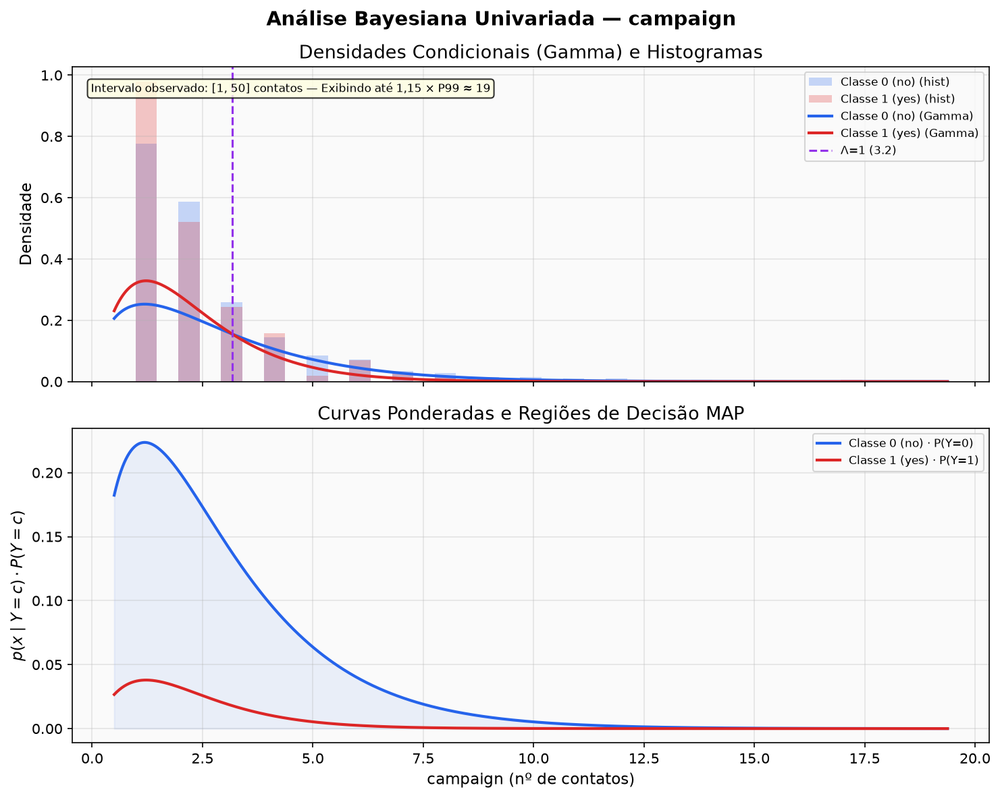
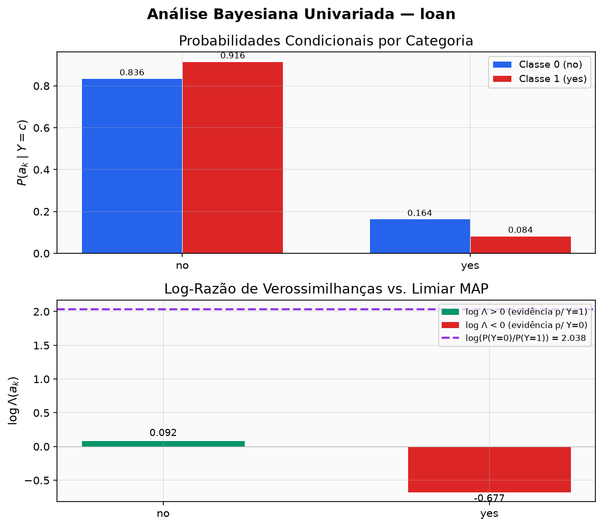

# Projeto de IA: Classificação Bayesiana Pura e Mista

Implementação rigorosa e reproduzível de um classificador probabilístico supervisionado baseado em **Inferência Bayesiana Pura** sobre o dataset bancário [UCI Bank Marketing](https://archive.ics.uci.edu/dataset/222/bank+marketing). A regra do classificador foi implementada pela dupla, sem uso de um classificador pronto; o SciPy é empregado apenas no ajuste numérico do MLE da distribuição Gamma e em diagnósticos auxiliares.

## Execução rápida — passo a passo

O roteiro abaixo parte de uma máquina com Python 3.12 ou superior. Se o repositório já
estiver baixado, entre na pasta `Projeto-2VA` e comece pela criação do ambiente virtual.

### Windows — PowerShell

```powershell
# 1. Baixar o projeto e entrar na raiz
git clone https://github.com/IA-PV/Projeto-2VA.git
cd Projeto-2VA

# 2. Criar e ativar o ambiente virtual
python -m venv .venv
.\.venv\Scripts\Activate.ps1

# 3. Instalar as dependências fixadas
python -m pip install -r requirements.txt

# 4. Validar o dataset, o split e o ajuste do modelo
python -m src.run_experiment --validate-only

# 5. Executar todos os testes automatizados
python -m pytest -q

# 6. Reproduzir todas as análises, figuras e a avaliação final
python -m src.run_experiment --force-reproduce

# 7. Consultar as métricas finais
Get-Content .\reports\metrics\final_metrics.json
```

### Linux ou macOS — Bash

```bash
# 1. Baixar o projeto e entrar na raiz
git clone https://github.com/IA-PV/Projeto-2VA.git
cd Projeto-2VA

# 2. Criar e ativar o ambiente virtual
python3 -m venv .venv
source .venv/bin/activate

# 3. Instalar as dependências fixadas
python -m pip install -r requirements.txt

# 4. Validar o dataset, o split e o ajuste do modelo
python -m src.run_experiment --validate-only

# 5. Executar todos os testes automatizados
python -m pytest -q

# 6. Reproduzir todas as análises, figuras e a avaliação final
python -m src.run_experiment --force-reproduce

# 7. Consultar as métricas finais
cat reports/metrics/final_metrics.json
```

As tabelas são gravadas em `reports/metrics/` e as figuras em `reports/figures/`.
O comando com `--force-reproduce` acessa o holdout e registra uma nova execução auditada;
para regenerar apenas as análises preservando a avaliação existente, use
`python -m src.run_experiment`.

---

## 1. Título e Objetivo

- **Título**: Estudo Dirigido de Inferência e Classificação Bayesiana Supervisionada.
- **Objetivo**: Estimar probabilidades a priori e verossimilhanças condicionais a partir de dados reais, comparar formulações teóricas (Normal, Gamma e Categórica com Laplace), analisar o comportamento probabilístico univariado (razão de verossimilhanças $\Lambda(x)$, fronteiras de decisão e posteriors normalizadas) e combinar as evidências em um classificador ingênuo misto (*Mixed Naive Bayes*), auditando seu desempenho contra o holdout congelado e confrontando-o com o baseline majoritário.

---

## 2. Integrantes

- **Vitor Antônio Silvestre Santos**
- **Pedro Tobias Souza Guerra**

---

## 3. Origem e Versão do Dataset

- **Dataset**: Amostra reduzida oficial contendo **4.521 observações** e 17 atributos do conjunto [Bank Marketing da UCI](https://archive.ics.uci.edu/dataset/222/bank+marketing) (`bank.csv`).
- **Arquivo local**: [`data/raw/bank.csv`](data/raw/bank.csv).
- **Integridade Criptográfica (SHA-256 com LF normalizado)**:
  `dc8d576e9bda0f41ee891251bd84bab9a39ce576cba715aac08adc2374a01fde`
- **Substituição**: A fonte de dados é congelada. Qualquer alteração ou substituição exige atualização e revisão formal do contrato de dados.

### 3.1 Atributos disponíveis e tipos

A amostra possui 16 atributos preditores e a variável-alvo `y`. A classificação abaixo considera tanto o tipo armazenado no CSV quanto o significado de cada variável:

| Atributo | Tipo | Significado resumido |
|---|---|---|
| `age` | Numérico inteiro | Idade do cliente |
| `job` | Categórico nominal | Ocupação |
| `marital` | Categórico nominal | Estado civil |
| `education` | Categórico ordinal | Escolaridade declarada |
| `default` | Categórico binário | Inadimplência de crédito |
| `balance` | Numérico inteiro | Saldo médio anual |
| `housing` | Categórico binário | Empréstimo habitacional |
| `loan` | Categórico binário | Empréstimo pessoal |
| `contact` | Categórico nominal | Meio de contato |
| `day` | Numérico inteiro | Dia do mês do último contato |
| `month` | Categórico nominal | Mês do último contato |
| `duration` | Numérico inteiro positivo | Duração do último contato, em segundos |
| `campaign` | Numérico inteiro | Contatos realizados nesta campanha |
| `pdays` | Numérico inteiro | Dias desde o contato anterior; `-1` indica ausência de contato anterior |
| `previous` | Numérico inteiro | Contatos anteriores à campanha atual |
| `poutcome` | Categórico nominal | Resultado da campanha anterior |
| `y` | Categórico binário (alvo) | Adesão ao depósito a prazo: `no` ou `yes` |

---

## 4. Problema de Classificação

O problema consiste em prever se um cliente bancário subscreverá um depósito a prazo fixo (*term deposit*) após uma abordagem telefônica de marketing direto.
O desafio central reside no **desbalanceamento severo das classes**:
- Na base total de 4.521 amostras, **88,48%** (4.000) pertencem à classe negativa (`no`) e apenas **11,52%** (521) à classe positiva (`yes`).
- Na presença de fortes desbalanceamentos, a acurácia isolada é enganosa (um classificador ingênuo que preveja sempre `no` atinge ~88,5% de acurácia com recall zero). A modelagem bayesiana lida explicitamente com as probabilidades a priori e as razões de verossimilhança.

---

## 5. Alvo e Classes

A variável-alvo $y$ é mapeada de maneira estrita e determinística:
- `no` $\rightarrow \mathbf{0}$ (classe negativa: o cliente não subscreveu o produto).
- `yes` $\rightarrow \mathbf{1}$ (classe positiva: o cliente subscreveu o produto).
- A ordem canônica dos rótulos em todas as matrizes e métricas é $\mathbf{[0, 1]}$.

---

## 6. Três Atributos Selecionados

Conforme definido no contrato de dados e na especificação do projeto, foram selecionados exatamente três atributos de tipos distintos:
1. **`age`** (numérico inteiro, modelado como contínuo): Idade do cliente (faixa observada nesta amostra: 19 a 87 anos).
2. **`campaign`** (numérico inteiro positivo, modelado como contínuo): Número de contatos realizados durante esta campanha para o cliente (faixa observada nesta amostra: 1 a 50 contatos).
3. **`loan`** (categórico binário): Se o cliente possui empréstimo pessoal ativo com domínio estrito $\mathcal{D} = \{\text{no}, \text{yes}\}$.

As características foram escolhidas para combinar dois tipos de evidência em um único classificador e permitir análises com interpretações distintas. `age` representa um perfil demográfico do cliente; `campaign` representa o esforço e intensidade operacional de marketing direcionado ao cliente; `loan` introduz uma variável binária indicadora de endividamento pessoal pré-existente. Essa escolha demonstra a combinação de densidades contínuas (Normal e Gamma) com probabilidades discretas (Categórica com suavização de Laplace para $K=2$).

---

## 7. Resumo das Distribuições e Modelagem

Toda a estimação de parâmetros é realizada **estritamente sobre as 3.616 observações de treinamento** (livre de vazamento de dados / data leakage):

| Componente | Família Probabilística | Método de Estimação no Treino |
|---|---|---|
| **Prior** $P(Y=c)$ | Empírica | Frequência relativa: $N_c / N_{\text{train}}$ ($P(0) \approx 0{,}8847$, $P(1) \approx 0{,}1153$) |
| **`age`** | Normal (Gaussiana) | $\hat{\mu}_c$ e $\hat{\sigma}_c^2$ via MLE com $N_c$ no denominador (`ddof=0`) |
| **`campaign`** | Gamma | Forma $\hat{k}_c$ e escala $\hat{\theta}_c$ via MLE com localização fixa em zero (`floc=0`) |
| **`loan`** | Categórica | Frequência com suavização de Laplace: $\frac{N_{c,k} + \alpha}{N_c + \alpha K}$ com $\alpha=1$ e $K=2$ |
| *Diagnóstico* | Exponencial | Taxa $\hat{\lambda}_c = 1/\bar{x}_c$; superada pela Gamma no critério AIC |

### 7.1 Justificativas das hipóteses probabilísticas

- **`age` — Normal:** idades de clientes adultos tendem a se concentrar em torno de uma região central, com frequências menores nos extremos. A Normal fornece uma aproximação contínua simples para esse formato e permite obter fronteiras analíticas. Trata-se de uma aproximação: idade é inteira, limitada e pode misturar subpopulações, razão pela qual a aderência também é verificada visualmente nos histogramas.
- **`campaign` — Gamma:** a contagem de contatos é estritamente positiva ($x \ge 1$), fortemente assimétrica à direita e possui cauda longa (a vasta maioria dos clientes recebe 1 a 3 contatos, mas alguns chegam até 50). A Gamma possui suporte $(0, \infty)$, acomodando a assimetria e a cauda longa. Além disso, a Gamma obteve AIC substancialmente menor que a Exponencial nas duas classes do treino ($12.661{,}02$ vs $13.132{,}14$ na classe 0; $1.404{,}33$ vs $1.519{,}18$ na classe 1).
- **`loan` — Categórica:** o empréstimo pessoal é uma variável dicotômica nominal com categorias $\text{no}$ e $\text{yes}$. A modelagem adequada consiste em estimar $P(X=a_k \mid Y=c)$ para $k \in \{\text{no}, \text{yes}\}$. A suavização de Laplace ($\alpha=1$, $K=2$) garante probabilidades estritamente positivas e bem calibradas.

### 7.2 Divisão dos dados e priors

A divisão estratificada preservou aproximadamente o desbalanceamento da base:

| Conjunto | Total | Classe 0 (`no`) | Classe 1 (`yes`) |
|---|---:|---:|---:|
| Base completa | 4.521 | 4.000 (88,48%) | 521 (11,52%) |
| Treino | 3.616 (80%) | 3.199 (88,47%) | 417 (11,53%) |
| Teste | 905 (20%) | 801 (88,51%) | 104 (11,49%) |

Foram usados `test_size=0.20`, `random_state=42` e estratificação por `y`. As priors estimadas exclusivamente no treino são $P(Y=0)=0{,}884679$ e $P(Y=1)=0{,}115321$.

### 7.3 Parâmetros estimados exclusivamente no treino

| Característica | Classe 0 (`no`) | Classe 1 (`yes`) |
|---|---|---|
| `age` — Normal | $\mu_0=40{,}8718$, $\sigma_0^2=101{,}2452$ | $\mu_1=42{,}3645$, $\sigma_1^2=170{,}6969$ |
| `campaign` — Gamma | $k_0=1{,}7107$, $\theta_0=1{,}6742$ | $k_1=2{,}1680$, $\theta_1=1{,}0464$ |
| `loan=no` | $0{,}835676$ | $0{,}916468$ |
| `loan=yes` | $0{,}164324$ | $0{,}083532$ |

Os valores completos e as fronteiras calculadas estão em [`distribution_parameters.json`](reports/metrics/distribution_parameters.json).

- **Razão de Verossimilhança Univariada**: $\Lambda(x) = \frac{p(x \mid Y=1)}{p(x \mid Y=0)}$.
- **Regra de Decisão MAP**: Decide classe 1 se $\Lambda(x) > \frac{P(Y=0)}{P(Y=1)} \approx 7{,}6715$.
- **Combinação Multivariada**: O modelo misto assume independência condicional ingênua e soma as evidências em escala logarítmica natural:
  $$\ln P(Y=c \mid \mathbf{x}) \propto \ln P(Y=c) + \ln p(\text{age} \mid c) + \ln p(\text{campaign} \mid c) + \ln P(\text{loan} \mid c)$$
  As probabilidades posteriores normalizadas são obtidas numericamente via `logsumexp`.

### 7.4 Exemplos numéricos completos do Teorema de Bayes

Para duas classes, a posterior da classe positiva é calculada por:

$$
P(Y=1\mid x)=\frac{p(x\mid Y=1)P(Y=1)}{p(x\mid Y=0)P(Y=0)+p(x\mid Y=1)P(Y=1)}.
$$

Os valores abaixo foram arredondados apenas para apresentação; o pipeline usa precisão completa.

**Exemplo 1 — `age=20`:**

$$
P(Y=1\mid 20)=
\frac{0{,}00705535\times0{,}1153208}
{0{,}00461202\times0{,}8846792+0{,}00705535\times0{,}1153208}
=\frac{0{,}00081363}{0{,}00489379}
\approx0{,}16626.
$$

Embora $p(20\mid Y=1)>p(20\mid Y=0)$ e $\Lambda(20)=1{,}5298$ forneça evidência em favor de `yes`, a posterior positiva permanece em apenas 16,63% por causa da prior majoritariamente negativa. Esse exemplo evidencia a diferença entre **verossimilhança**, que avalia o valor observado supondo uma classe, e **posterior**, que avalia a classe após combinar likelihood e prior.

**Exemplo 2 — `campaign=1`:**

$$
P(Y=1\mid 1)=
\frac{0{,}32180527\times0{,}1153208}
{0{,}25023961\times0{,}8846792+0{,}32180527\times0{,}1153208}
=\frac{0{,}03711084}{0{,}25849033}
\approx0{,}14357.
$$

A razão $\Lambda(1)=1{,}2860$ favorece ligeiramente a adesão (contatos iniciais têm maior taxa de conversão), mas não supera o limiar MAP de 7,6715; por isso o classificador univariado decide `no`.

**Exemplo 3 — `loan=no`:**

$$
P(Y=1\mid no)=
\frac{0{,}91646778\times0{,}1153208}
{0{,}83567635\times0{,}8846792+0{,}91646778\times0{,}1153208}
=\frac{0{,}10568779}{0{,}84501258}
\approx0{,}12508.
$$

Apesar de a ausência de empréstimo ter $\Lambda=1{,}0967>1$, essa evidência é modesta frente à prior negativa, e a decisão univariada continua sendo `no`. Outros valores podem ser consultados em [`age_univariate_examples.csv`](reports/metrics/age_univariate_examples.csv), [`campaign_univariate_examples.csv`](reports/metrics/campaign_univariate_examples.csv) e [`loan_univariate_examples.csv`](reports/metrics/loan_univariate_examples.csv).

### 7.5 Comportamento por classe e regras univariadas


- Para `age`, as distribuições apresentam forte sobreposição. A likelihood favorece `yes` abaixo de aproximadamente 26,95 anos e acima de 50,44 anos, mas, no domínio observado, a decisão MAP somente muda para `yes` acima de 72,64 anos.



- Para `campaign`, poucos contatos (1 ou 2) favorecem `yes` na likelihood ($\Lambda(x) > 1$ até a fronteira de verossimilhança em 3,18 contatos). Acima de 3,18 contatos, a probabilidade decresce rapidamente na classe positiva ($\theta_1 \approx 1{,}05$ vs $\theta_0 \approx 1{,}67$). No entanto, a prior negativa domina em todo o domínio: não existe fronteira MAP univariada positiva para `campaign`.



- Para `loan`, a ausência de empréstimo (`no`) tem $\Lambda \approx 1{,}10$ (taxa de adesão sutilmente maior), enquanto ter empréstimo (`yes`) reduz a adesão ($\Lambda \approx 0{,}51$). Nenhuma das categorias supera o limiar MAP de 7,6715; portanto, ambas são classificadas univariadamente como `no`.

Qualitativamente, `campaign` e `age` possuem as maiores dinâmicas de likelihood, enquanto `loan` é binária e restrita. Essa conclusão decorre das evidências puras do treino, sem consultar o conjunto de teste.

---

## 8. Estrutura do Repositório

```text
.
├── data/
│   └── raw/
│       └── bank.csv             # Amostra reduzida congelada (UCI)
├── notebooks/
│   └── 02_analises_univariadas.ipynb # Inspeção e visualização univariada
├── reports/
│   ├── figures/                 # Gráficos e curvas gerados programaticamente
│   │   ├── age_conditional_and_decision.png
│   │   ├── campaign_conditional_and_decision.png
│   │   ├── loan_conditional_probabilities.png
│   │   └── confusion_matrix.png
│   └── metrics/                 # Relatórios JSON/CSV auditáveis versionados
│       ├── data_split.json
│       ├── distribution_parameters.json
│       ├── model_parameters.json
│       ├── final_metrics.json
│       ├── run_manifest.json
│       ├── confusion_matrix.csv
│       ├── error_groups.csv
│       ├── age_by_loan_within_class.csv
│       ├── age_univariate_examples.csv
│       ├── campaign_univariate_examples.csv
│       └── loan_univariate_examples.csv
├── src/                         # Implementação da biblioteca científica
│   ├── __init__.py
│   ├── config.py                # Configuração centralizada e ExperimentConfig imutável
│   ├── data.py                  # Ingestão, validação de contrato e split estratificado
│   ├── distributions.py         # Ajuste de distribuições contínuas e categóricas
│   ├── univariate.py            # Cálculo de posteriors, odds ratio e fronteiras
│   ├── mixed_naive_bayes.py     # Classificador Bayesiano Misto próprio
│   ├── evaluation.py            # Métricas manuais, matriz de confusão e baseline
│   ├── plotting.py              # Visualizações padronizadas
│   ├── run_univariate.py        # Runner da análise univariada
│   ├── run_evaluation.py        # Runner auditado da avaliação no holdout
│   └── run_experiment.py        # Orquestrador oficial do estudo completo
├── tests/                       # Suíte automatizada de testes e validação matemática
│   ├── conftest.py
│   ├── test_data.py
│   ├── test_data_leakage.py
│   ├── test_distributions.py
│   ├── test_univariate.py
│   ├── test_mixed_naive_bayes.py
│   ├── test_evaluation.py
│   ├── test_final_evaluation.py
│   └── test_reproducibility.py  # Testes de reprodutibilidade e conformidade
├── pytest.ini                   # Configuração de execução do pytest
├── requirements.txt             # Dependências diretas com versões exatas testadas
└── README.md                    # Documentação oficial de entrega
```

---

## 9. Pré-requisitos de Ambiente

- **Linguagem**: Python $\ge$ 3.12 (pipeline e dependências fixadas validados no **Python 3.12.10**).
- **Sistema Operacional**: Windows, Linux ou macOS.
- **Gerenciador de Ambientes**: Módulo padrão `venv` do Python.

---

## 10. Instalação

Abra o terminal na raiz do repositório:

### No Windows (PowerShell):
```powershell
python -m venv .venv
.\.venv\Scripts\Activate.ps1
python -m pip install -r requirements.txt
```

### No Linux / macOS (Bash):
```bash
python3 -m venv .venv
source .venv/bin/activate
python -m pip install -r requirements.txt
```

---

## 11. Referência dos Comandos de Validação, Teste e Execução

### 11.1 Validação de Dados e Ambiente (Somente Leitura)
Executa todas as checagens formais de contrato, esquema, hash e split sem criar ou modificar nenhum arquivo em disco:
```bash
python -m src.run_experiment --validate-only
```

### 11.2 Regeneração das análises sem novo acesso ao holdout
Regenera parâmetros, tabelas CSV, figuras PNG e o manifesto. Se já existir uma avaliação
final auditada, suas métricas são preservadas para evitar acesso desnecessário ao teste:
```bash
python -m src.run_experiment
```

### 11.3 Reprodução integral, incluindo a avaliação final
Em um clone destinado à reprodução, este comando também recalcula a matriz de confusão
e as métricas do holdout. A nova execução fica registrada em `evaluation_history.json`:
```bash
python -m src.run_experiment --force-reproduce
```

### 11.4 Execução da Suíte de Testes Automatizada
Executa os 247 testes unitários, matemáticos e de integração:
```bash
pytest -q
```

### 11.5 Inspeção Interativa dos Notebooks
Para inspecionar as tabelas formatadas e diagnósticos interativamente:
```bash
python -m pip install ipykernel
```
Abra [`notebooks/02_analises_univariadas.ipynb`](notebooks/02_analises_univariadas.ipynb) no Jupyter Lab ou VS Code, selecione o kernel `.venv` e execute todas as células em ordem (`Run All`).

---

## 12. Descrição das Saídas e Métricas Auditadas

A execução do estudo consolida artefatos em `reports/`:

### 12.1 Manifesto de Execução ([`run_manifest.json`](reports/metrics/run_manifest.json))
Registra metadados de execução, plataforma, hash dos dados, hiperparâmetros e famílias de distribuição de acordo com a especificação de reprodutibilidade do projeto.

O diagnóstico [`age_by_loan_within_class.csv`](reports/metrics/age_by_loan_within_class.csv)
resume, exclusivamente no treino, a contagem e a idade média/mediana por classe e posse de
empréstimo pessoal. Ele documenta quantitativamente a associação entre os atributos condicionada à classe.

### 12.2 Métricas Finais Auditadas no Holdout ([`final_metrics.json`](reports/metrics/final_metrics.json))
Resultados obtidos sobre as 905 observações congeladas de teste:

| Métrica | Classificador Misto Bayesiano | Baseline Majoritário (sempre classe 0) |
|---|---|---|
| **Acurácia** | **$88{,}29\%$** ($0{,}8829$) | $88{,}51\%$ ($0{,}8851$) |
| **Precisão** | **$41{,}67\%$** ($0{,}4167$) | $0{,}00\%$ ($0{,}0000$) |
| **Recall (Sensibilidade)** | **$4{,}81\%$** ($0{,}0481$) | $0{,}00\%$ ($0{,}0000$) |
| **F1-Score** | **$8{,}62\%$** ($0{,}0862$) | $0{,}00\%$ ($0{,}0000$) |

### 12.3 Matriz de Confusão Oficial ([`confusion_matrix.csv`](reports/metrics/confusion_matrix.csv))
Ordem canônica $[0, 1]$ (linhas: real, colunas: predito):
- **Verdadeiros Negativos (VN)**: $794$ (cliente não aderiu e o modelo previu não adesão)
- **Falsos Positivos (FP)**: $7$ (cliente não aderiu, mas o modelo previu adesão)
- **Falsos Negativos (FN)**: $99$ (cliente aderiu, mas o modelo previu não adesão)
- **Verdadeiros Positivos (VP)**: $5$ (cliente aderiu e o modelo previu adesão)
- **Total**: $794 + 7 + 99 + 5 = 905$ observações.


### 12.4 Interpretação dos erros

Os **99 falsos negativos** constituem a principal dificuldade de detecção do modelo: decorrem da dominância da prior negativa ($88{,}47\%$), exigindo uma razão de verossimilhanças combinada superior a $7{,}6715$. Como as evidências de `campaign` (máximo de $\Lambda \approx 1{,}29$) e `loan` (máximo de $\Lambda \approx 1{,}10$) são modestas, clientes de idade intermediária (média de 41,37 anos neste grupo) não acumulam verossimilhança conjunta suficiente para superar a prior.

Os **7 falsos positivos** concentram-se em clientes idosos (média de idade de 78,86 anos e mediana de 79 anos), onde a maior dispersão da Gaussiana da classe positiva ($\sigma_1^2 \approx 170{,}70$ vs $\sigma_0^2 \approx 101{,}25$) projeta densidades relativas expressivas na cauda superior de idade, superando o limiar de decisão mesmo para clientes que não subscreveram o produto.

Os **5 verdadeiros positivos** também refletem o perfil demográfico sênior (média de 75,20 anos) com poucos contatos de campanha (média de 1,60 contatos, todos com `loan=no`), demonstrando que o modelo é capaz de identificar com precisão moderada ($41{,}67\%$) os clientes em que a convergência de fatores atinge significância probabilística estrita.

A acurácia de 88,29% é muito próxima ao baseline majoritário (88,51%). Esse resultado ilustra de forma didática e transparente o impacto do desbalanceamento severo: métricas de precisão e recall são essenciais para diagnosticar o comportamento do classificador. Os resumos numéricos completos dos quatro grupos de erro estão disponíveis em [`error_groups.csv`](reports/metrics/error_groups.csv).

---

## 13. Decisões de Reprodutibilidade

- **Semente e Divisão**: Semente fixa `random_state = 42`, divisão estratificada `test_size = 0.20` preservando aproximadamente as proporções das classes em treino e teste.
- **Isolamento Total do Holdout**: O conjunto de teste nunca participa da estimativa de parâmetros, seleção de hiperparâmetros ou calibração de priors.
- **Portão de Congelamento**: A avaliação no holdout é protegida por trava auditável em `reports/metrics/freeze_checklist.json` e `evaluation_history.json`.
- **Portabilidade de Caminhos**: Uso exclusivo de `pathlib.Path` e caminhos relativos ao projeto, sem caminhos absolutos locais de máquina.
- **Normalização de Final de Linha**: SHA-256 computado com normalização de `\r\n` para `\n`, eliminando divergências entre sistemas operacionais.

---

## 14. Limitações Principais

1. **Hipótese Ingênua de Independência Condicional**: Assume que idade, campanha e empréstimo são condicionalmente independentes dada a classe. No entanto, clientes com empréstimo pessoal na classe aderente tendem a ser mais jovens (média de 38,24 anos vs 42,73 anos para sem empréstimo), conforme demonstrado em [`age_by_loan_within_class.csv`](reports/metrics/age_by_loan_within_class.csv). Essa dependência residual ilustra a natureza aproximada do Naive Bayes.
2. **Normal como aproximação para `age`**: Idade é inteira e truncada. A Normal foi adotada pela simplicidade analítica e pela clareza na interpretação das fronteiras de decisão.
3. **Gamma para `campaign`**: A Gamma modela adequadamente o suporte estritamente positivo e a assimetria acentuada dos contatos (AIC menor que o da Exponencial). No entanto, contatos são dados discretos inteiros (dados de contagem).
4. **Desbalanceamento Severo**: A forte assimetria a priori ($88{,}47\%$ de negativos) exige evidência substancialmente alta ($\Lambda > 7{,}67$) para qualquer predição positiva, resultando em um modelo naturalmente conservador no recall.

---

## 15. Uso de Ferramentas de IA Generativa e Processo de Verificação

Em consonância com as práticas éticas e acadêmicas de integridade científica:
- **Áreas com Apoio de IA**: Auxílio no planejamento estrutural da documentação e sugestões de arquitetura de testes unitários.
- **Implementação e Auditoria Humana**: Toda a matemática, deduções analíticas de máxima verossimilhança (MLE), parametrizações de log-densidades e cálculos de matriz de confusão foram conferidos, implementados e auditados pelos integrantes.
- **Validação Cruzada por Oráculos**: Todas as implementações manuais foram estritamente validadas contra oráculos secundários independentes (`scipy.stats` para distribuições e `sklearn.metrics` para matriz de confusão e métricas).
- **Responsabilidade**: A IA atuou como ferramenta de produtividade e pair programming; a responsabilidade técnica e científica final pertence integralmente aos autores.

---

## 16. Especificações Técnicas e Módulos do Projeto

As decisões de arquitetura e governança do projeto foram organizadas em módulos com responsabilidades bem delimitadas:

| Módulo / Especificação | Escopo e Responsabilidade |
|---|---|
| **01. Engenharia e Governança** | Padrões de engenharia de software, tipagem estrita, estrutura de diretórios e governança do repositório |
| **02. Contrato de Dados e Divisão** | Ingestão, validação de integridade criptográfica (SHA-256), esquema e split estratificado congelado |
| **03. Modelagem Probabilística** | Modelagem probabilística teórica (Normal, Gamma, Laplace e priors empíricas de treino) |
| **04. Análises Univariadas** | Experimentos Bayesianos univariados, cálculo da razão $\Lambda(x)$, fronteiras analíticas e posteriors |
| **05. Classificador Misto** | Implementação do Classificador Naive Bayes Misto supervisionado conjunto |
| **06. Estratégia de Testes** | Estratégia de testes automatizados e validação matemática de fórmulas contra oráculos |
| **07. Avaliação e Erros** | Protocolo de avaliação oficial no holdout, cálculo manual de métricas e análise de erros |
| **08. Reprodutibilidade** | Orquestrador completo, configuração imutável, dependências fixadas e manifesto de execução |

---

## 17. Licença e Citação da Base de Dados

O dataset original está sob licença **Creative Commons Attribution 4.0 International (CC BY 4.0)**.
Citação formal:
> **Moro, S., Cortez, P., & Rita, P. (2014).** *A Data-Driven Approach to Predict the Success of Bank Telemarketing.* Decision Support Systems, Elsevier, 62:22-31.
